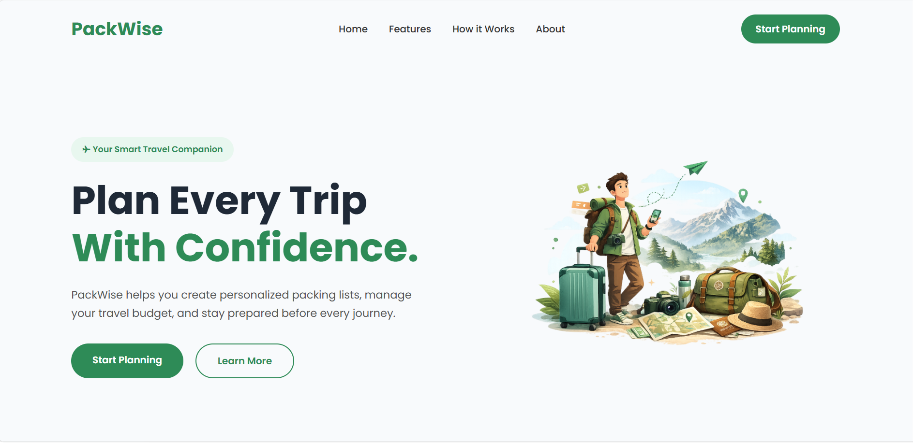

 PackWise — Smart Travel Companion


Plan smarter. Pack better. Travel stress-free.


PackWise is a multi-page travel companion web app that helps you plan your trip, generate a smart packing checklist, track your budget by category, and view everything at a glance on your personal dashboard.

Built with pure HTML, CSS & JavaScript — no frameworks, no backend, no login required. Everything runs in the browser.


🔗 View Live





<p>✨ Features</p>


<p>✈️ Trip Planner — Enter destination, duration, weather, trip type, travelers and budget</p>
<p>🧳 Smart Checklist — Auto-generated packing list based on your trip details with custom item support</p>
<p>💰 Budget Tracker — Track expenses by category with real-time remaining balance</p>
<p>📊 Dashboard — Complete trip overview with packing progress and budget summary</p>
<p>📄 Export as PDF — Download your dashboard as a PDF with one click</p>
<p>💾 Persistent Data — All data saved in localStorage, synced across all pages</p>
<p>📱 Responsive Design — Works on desktop and mobile</p>


🗺️ How It Works


Home → Planner → Checklist → Budget → Dashboard


<p>Home — Learn about the app and get started</p>
<p>Planner — Fill in your trip details (saved to localStorage)</p>
<p>Checklist — Get a smart packing list, check items off as you pack</p>
<p>Budget — Add and track expenses by category</p>
<p>Dashboard — See your full trip summary, packing progress and budget at a glance</p>
<p>Export — Download your dashboard as a PDF</p>


📁 Project Structure

```
PackWise/
├── index.html              # Home page
├── style.css               # Global styles
├── pages/
│   ├── planner.html        # Trip planner
│   ├── checklist.html      # Packing checklist
│   ├── budget.html         # Budget tracker
│   ├── dashboard.html      # Dashboard
│   └── about.html          # About page
├── css/
│   ├── planner.css
│   ├── checklist.css
│   ├── budget.css
│   ├── dashboard.css
│   └── about.css
├── js/
│   ├── planner.js
│   ├── checklist.js
│   ├── budget.js
│   └── dashboard.js
└── assets/
    └── travelimage.png
```
 Getting Started

Run Locally
Clone the repository:


bashgit clone https://github.com/prince-kr-gupta/PackWise

bashcd PackWise


Open index.html in your browser — that's it!


No installation, no dependencies, no build step needed.


👤 Developer

Prince Kumar Gupta

💼 LinkedIn → https://www.linkedin.com/in/prince-kumar-gupta-99b69a36b/


🏆 About This Project

PackWise was built as a Hackathon Project to solve real travel planning problems using simple and elegant web technologies. The entire app runs in the browser with zero dependencies.


📄 License

This project is open source and available under the MIT License.


<p align="center">Built with ❤️ by Prince Kumar Gupta</p>
